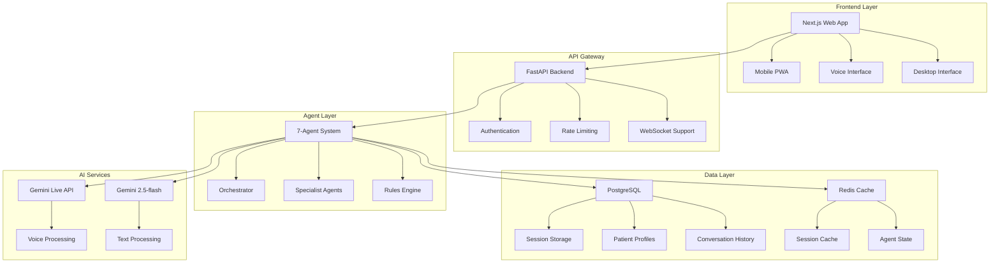

# HealthAngel Plus - Database, Next.js UI, Mobile & Voice Integration PRD

**Product Requirements Document for Enhanced HealthAngel System**

---

## 📋 Executive Summary

This PRD outlines the transformation of the existing `smart_health_agent_plus.py` system into a comprehensive healthcare platform with persistent data storage, modern web interface, mobile optimization, and voice interaction capabilities. The system will maintain the existing 7-agent hybrid architecture while adding enterprise-grade features for production deployment.

---

## 🎯 Project Overview

### Current State
- **Base System**: `smart_health_agent_plus.py` (7-Agent Hybrid Architecture)
- **Storage**: In-memory session management (`InMemorySessionService`)
- **UI**: Basic FastAPI web interface (`simple_web_app.py`)
- **Architecture**: Python backend with Google ADK agents
- **AI**: Gemini 2.5-flash with JSON rules engine

### Target State
- **Database**: PostgreSQL with Redis caching
- **Frontend**: Next.js 14 with TypeScript and Tailwind CSS
- **Mobile**: Responsive design with PWA capabilities
- **Voice**: Gemini Live API integration for real-time voice chat
- **Backend**: Enhanced FastAPI with database integration
- **Deployment**: Containerized microservices on Google Cloud

---

## 🏗️ System Architecture

### High-Level Architecture



---

## 📊 Feature Implementation Plan

## Phase 1: Database Integration & Backend Enhancement

### Feature 1.1: PostgreSQL Database Schema

#### Functional Changes
- **Persistent Session Storage**: Replace in-memory sessions with database persistence
- **Patient Profile Management**: Store comprehensive patient profiles across sessions
- **Conversation History**: Maintain complete conversation logs for continuity
- **Agent State Persistence**: Store agent decisions and routing history
- **Audit Trail**: Complete compliance and debugging logs

#### Technical Changes
- **Database**: PostgreSQL 15+ with connection pooling
- **ORM**: SQLAlchemy 2.0 with async support
- **Migrations**: Alembic for schema management
- **Connection Pool**: asyncpg for async database operations

#### Code Changes Required

**New Files:**
```python
# database/models.py
from sqlalchemy import Column, String, Integer, DateTime, JSON, Boolean, Text
from sqlalchemy.ext.declarative import declarative_base
from sqlalchemy.dialects.postgresql import UUID
import uuid

Base = declarative_base()

class PatientProfile(Base):
    __tablename__ = "patient_profiles"
    
    id = Column(UUID(as_uuid=True), primary_key=True, default=uuid.uuid4)
    user_id = Column(String(255), unique=True, nullable=False, index=True)
    demographics = Column(JSON)
    health_conditions = Column(JSON)
    insurance_status = Column(JSON)
    technology_access = Column(JSON)
    preferences = Column(JSON)
    consent_status = Column(JSON)
    risk_factors = Column(JSON)
    created_at = Column(DateTime, default=datetime.utcnow)
    updated_at = Column(DateTime, default=datetime.utcnow, onupdate=datetime.utcnow)

class Session(Base):
    __tablename__ = "sessions"
    
    id = Column(UUID(as_uuid=True), primary_key=True, default=uuid.uuid4)
    user_id = Column(String(255), nullable=False, index=True)
    session_id = Column(String(255), unique=True, nullable=False, index=True)
    current_agent = Column(String(50))
    conversation_stage = Column(String(100))
    routing_decisions = Column(JSON)
    safety_flags = Column(JSON)
    created_at = Column(DateTime, default=datetime.utcnow)
    updated_at = Column(DateTime, default=datetime.utcnow, onupdate=datetime.utcnow)
    is_active = Column(Boolean, default=True)

class ConversationMessage(Base):
    __tablename__ = "conversation_messages"
    
    id = Column(UUID(as_uuid=True), primary_key=True, default=uuid.uuid4)
    session_id = Column(String(255), nullable=False, index=True)
    user_id = Column(String(255), nullable=False, index=True)
    message_type = Column(String(20))  # 'user', 'assistant', 'system'
    content = Column(Text, nullable=False)
    metadata = Column(JSON)  # Agent info, tools used, etc.
    timestamp = Column(DateTime, default=datetime.utcnow)
```

**Modified Files:**
```python
# app/smart_health_agent_plus.py - Database Integration
from database.models import PatientProfile, Session, ConversationMessage
from database.database import get_db_session, DatabaseSessionService

class HealthcareAssistantPlus:
    def __init__(self, rules_dir: str = "rules"):
        # ... existing code ...
        self.db_session_service = DatabaseSessionService()
        # Replace InMemorySessionService with database service
        
    async def handle_patient_inquiry(self, user_id: str, message: str, session_id: Optional[str] = None):
        # Enhanced with database persistence
        async with get_db_session() as db:
            if session_id:
                session_context = await self.db_session_service.get_session(db, session_id)
            else:
                session_context = await self.db_session_service.create_session(db, user_id)
            
            # Store conversation message
            await self.db_session_service.store_message(
                db, session_context.session_id, user_id, "user", message
            )
            
            # ... existing agent logic ...
            
            # Store assistant response
            await self.db_session_service.store_message(
                db, session_context.session_id, user_id, "assistant", response_text
            )
```

### Feature 1.2: Redis Caching Layer

#### Functional Changes
- **Session Caching**: Fast session retrieval and state management
- **Agent State Cache**: Store agent decision trees and context
- **Rate Limiting**: Implement user-based rate limiting
- **Temporary Data**: Store temporary processing data

#### Technical Changes
- **Cache**: Redis 7+ with clustering support
- **Serialization**: JSON with compression for large objects
- **TTL Management**: Automatic expiration of cached data
- **Connection Pool**: Redis connection pooling for performance

#### Code Changes Required

**New Files:**
```python
# cache/redis_client.py
import redis.asyncio as redis
import json
import gzip
from typing import Any, Optional

class RedisCache:
    def __init__(self, redis_url: str):
        self.redis = redis.from_url(redis_url, decode_responses=False)
    
    async def set_session(self, session_id: str, data: dict, ttl: int = 3600):
        compressed_data = gzip.compress(json.dumps(data).encode())
        await self.redis.setex(f"session:{session_id}", ttl, compressed_data)
    
    async def get_session(self, session_id: str) -> Optional[dict]:
        data = await self.redis.get(f"session:{session_id}")
        if data:
            return json.loads(gzip.decompress(data).decode())
        return None
```

### Feature 1.3: Enhanced API Endpoints

#### Functional Changes
- **RESTful API**: Complete CRUD operations for all entities
- **WebSocket Support**: Real-time communication for voice chat
- **Authentication**: JWT-based user authentication
- **Rate Limiting**: Per-user and per-endpoint rate limiting

#### Technical Changes
- **FastAPI**: Enhanced with dependency injection
- **WebSockets**: Real-time bidirectional communication
- **JWT**: Secure token-based authentication
- **Pydantic**: Enhanced request/response models

#### Code Changes Required

**New Files:**
```python
# api/auth.py
from fastapi import Depends, HTTPException, status
from fastapi.security import HTTPBearer
import jwt

security = HTTPBearer()

async def get_current_user(token: str = Depends(security)):
    try:
        payload = jwt.decode(token.credentials, SECRET_KEY, algorithms=["HS256"])
        user_id = payload.get("sub")
        if user_id is None:
            raise HTTPException(status_code=401, detail="Invalid token")
        return user_id
    except jwt.PyJWTError:
        raise HTTPException(status_code=401, detail="Invalid token")

# api/websocket.py
from fastapi import WebSocket, WebSocketDisconnect
import json

class ConnectionManager:
    def __init__(self):
        self.active_connections: List[WebSocket] = []
    
    async def connect(self, websocket: WebSocket, user_id: str):
        await websocket.accept()
        self.active_connections.append(websocket)
    
    async def send_personal_message(self, message: str, websocket: WebSocket):
        await websocket.send_text(message)

manager = ConnectionManager()

@app.websocket("/ws/{user_id}")
async def websocket_endpoint(websocket: WebSocket, user_id: str):
    await manager.connect(websocket, user_id)
    try:
        while True:
            data = await websocket.receive_text()
            # Process voice data or text message
            response = await process_voice_message(user_id, data)
            await manager.send_personal_message(response, websocket)
    except WebSocketDisconnect:
        manager.disconnect(websocket)
```

---

## Phase 2: Next.js Frontend Development

### Feature 2.1: Next.js 14 Application Setup

#### Functional Changes
- **Modern React Framework**: Next.js 14 with App Router
- **TypeScript**: Full type safety across the application
- **Component Library**: Reusable UI components
- **State Management**: Zustand for global state management

#### Technical Changes
- **Framework**: Next.js 14 with App Router
- **Styling**: Tailwind CSS with custom design system
- **State**: Zustand for client state management
- **HTTP Client**: Axios with interceptors
- **WebSocket**: Native WebSocket API with reconnection

#### Code Structure
```
frontend/
├── app/
│   ├── layout.tsx
│   ├── page.tsx
│   ├── chat/
│   │   ├── page.tsx
│   │   └── components/
│   ├── voice/
│   │   ├── page.tsx
│   │   └── components/
│   └── api/
├── components/
│   ├── ui/
│   ├── chat/
│   └── voice/
├── lib/
│   ├── api.ts
│   ├── websocket.ts
│   └── utils.ts
├── stores/
│   └── chatStore.ts
└── types/
    └── index.ts
```

### Feature 2.2: Chat Interface Components

#### Functional Changes
- **Message Bubbles**: User and assistant message display
- **Typing Indicators**: Real-time typing feedback
- **Message History**: Scrollable conversation history
- **Quick Actions**: Service selection buttons
- **File Upload**: Support for document uploads

#### Technical Changes
- **Components**: React functional components with hooks
- **Styling**: Tailwind CSS with custom animations
- **Icons**: Lucide React icon library
- **Animations**: Framer Motion for smooth transitions

#### Code Changes Required

**New Files:**
```typescript
// components/chat/ChatInterface.tsx
'use client'

import { useState, useEffect, useRef } from 'react'
import { MessageBubble } from './MessageBubble'
import { TypingIndicator } from './TypingIndicator'
import { QuickActions } from './QuickActions'

interface Message {
  id: string
  type: 'user' | 'assistant' | 'system'
  content: string
  timestamp: Date
  metadata?: any
}

export function ChatInterface() {
  const [messages, setMessages] = useState<Message[]>([])
  const [inputValue, setInputValue] = useState('')
  const [isTyping, setIsTyping] = useState(false)
  const messagesEndRef = useRef<HTMLDivElement>(null)

  const scrollToBottom = () => {
    messagesEndRef.current?.scrollIntoView({ behavior: 'smooth' })
  }

  useEffect(() => {
    scrollToBottom()
  }, [messages])

  const sendMessage = async (content: string) => {
    const userMessage: Message = {
      id: Date.now().toString(),
      type: 'user',
      content,
      timestamp: new Date()
    }
    
    setMessages(prev => [...prev, userMessage])
    setIsTyping(true)
    
    try {
      const response = await fetch('/api/chat', {
        method: 'POST',
        headers: { 'Content-Type': 'application/json' },
        body: JSON.stringify({ message: content })
      })
      
      const data = await response.json()
      
      const assistantMessage: Message = {
        id: (Date.now() + 1).toString(),
        type: 'assistant',
        content: data.response,
        timestamp: new Date(),
        metadata: data.metadata
      }
      
      setMessages(prev => [...prev, assistantMessage])
    } catch (error) {
      console.error('Error sending message:', error)
    } finally {
      setIsTyping(false)
    }
  }

  return (
    <div className="flex flex-col h-full">
      <div className="flex-1 overflow-y-auto p-4 space-y-4">
        {messages.map((message) => (
          <MessageBubble key={message.id} message={message} />
        ))}
        {isTyping && <TypingIndicator />}
        <div ref={messagesEndRef} />
      </div>
      
      <div className="border-t p-4">
        <QuickActions onAction={sendMessage} />
        <div className="flex gap-2 mt-2">
          <input
            type="text"
            value={inputValue}
            onChange={(e) => setInputValue(e.target.value)}
            onKeyPress={(e) => e.key === 'Enter' && sendMessage(inputValue)}
            className="flex-1 p-2 border rounded-lg"
            placeholder="Type your message..."
          />
          <button
            onClick={() => sendMessage(inputValue)}
            className="px-4 py-2 bg-blue-500 text-white rounded-lg"
          >
            Send
          </button>
        </div>
      </div>
    </div>
  )
}
```

### Feature 2.3: Mobile Optimization & PWA

#### Functional Changes
- **Responsive Design**: Mobile-first responsive layout
- **PWA Features**: Installable app with offline capabilities
- **Touch Gestures**: Swipe and touch interactions
- **Mobile Navigation**: Bottom navigation for mobile
- **Offline Support**: Basic offline functionality

#### Technical Changes
- **PWA**: Service worker with caching strategies
- **Responsive**: Mobile-first CSS with breakpoints
- **Touch**: Touch event handling
- **Manifest**: Web app manifest for installation

#### Code Changes Required

**New Files:**
```typescript
// app/manifest.ts
import { MetadataRoute } from 'next'

export default function manifest(): MetadataRoute.Manifest {
  return {
    name: 'HealthAngel - Healthcare Assistant',
    short_name: 'HealthAngel',
    description: 'AI-powered healthcare navigation and patient routing',
    start_url: '/',
    display: 'standalone',
    background_color: '#ffffff',
    theme_color: '#20b2aa',
    icons: [
      {
        src: '/icon-192x192.png',
        sizes: '192x192',
        type: 'image/png'
      },
      {
        src: '/icon-512x512.png',
        sizes: '512x512',
        type: 'image/png'
      }
    ]
  }
}

// components/mobile/MobileNavigation.tsx
'use client'

import { Home, MessageCircle, Mic, User, Settings } from 'lucide-react'

export function MobileNavigation() {
  return (
    <nav className="fixed bottom-0 left-0 right-0 bg-white border-t border-gray-200 md:hidden">
      <div className="flex justify-around py-2">
        <button className="flex flex-col items-center p-2 text-blue-500">
          <Home size={24} />
          <span className="text-xs mt-1">Home</span>
        </button>
        <button className="flex flex-col items-center p-2 text-gray-500">
          <MessageCircle size={24} />
          <span className="text-xs mt-1">Chat</span>
        </button>
        <button className="flex flex-col items-center p-2 text-gray-500">
          <Mic size={24} />
          <span className="text-xs mt-1">Voice</span>
        </button>
        <button className="flex flex-col items-center p-2 text-gray-500">
          <User size={24} />
          <span className="text-xs mt-1">Profile</span>
        </button>
        <button className="flex flex-col items-center p-2 text-gray-500">
          <Settings size={24} />
          <span className="text-xs mt-1">Settings</span>
        </button>
      </div>
    </nav>
  )
}
```

---

## Phase 3: Voice Integration with Gemini Live API

### Feature 3.1: Voice Interface Implementation

#### Functional Changes
- **Real-time Voice Chat**: Two-way voice conversation with AI
- **Voice Commands**: Voice-activated service selection
- **Audio Processing**: Noise reduction and audio enhancement
- **Voice Feedback**: Audio responses from the assistant

#### Technical Changes
- **Gemini Live API**: Real-time voice processing
- **WebRTC**: Audio capture and streaming
- **Audio Processing**: Web Audio API for enhancement
- **WebSocket**: Real-time audio data transmission

#### Code Changes Required

**New Files:**
```typescript
// components/voice/VoiceInterface.tsx
'use client'

import { useState, useEffect, useRef } from 'react'
import { Mic, MicOff, Volume2, VolumeX } from 'lucide-react'

interface VoiceInterfaceProps {
  onTranscript: (text: string) => void
  onResponse: (audio: Blob) => void
}

export function VoiceInterface({ onTranscript, onResponse }: VoiceInterfaceProps) {
  const [isListening, setIsListening] = useState(false)
  const [isSpeaking, setIsSpeaking] = useState(false)
  const [isMuted, setIsMuted] = useState(false)
  const mediaRecorderRef = useRef<MediaRecorder | null>(null)
  const audioContextRef = useRef<AudioContext | null>(null)
  const websocketRef = useRef<WebSocket | null>(null)

  useEffect(() => {
    initializeAudio()
    return () => {
      cleanup()
    }
  }, [])

  const initializeAudio = async () => {
    try {
      const stream = await navigator.mediaDevices.getUserMedia({ 
        audio: {
          echoCancellation: true,
          noiseSuppression: true,
          sampleRate: 16000
        } 
      })
      
      audioContextRef.current = new AudioContext()
      const source = audioContextRef.current.createMediaStreamSource(stream)
      
      // Set up WebSocket connection to Gemini Live API
      websocketRef.current = new WebSocket('wss://api.gemini.google.com/v1beta/live')
      
      websocketRef.current.onopen = () => {
        console.log('Voice WebSocket connected')
      }
      
      websocketRef.current.onmessage = (event) => {
        const data = JSON.parse(event.data)
        if (data.audio) {
          // Play audio response
          playAudioResponse(data.audio)
        }
        if (data.transcript) {
          onTranscript(data.transcript)
        }
      }
      
    } catch (error) {
      console.error('Error initializing audio:', error)
    }
  }

  const startListening = () => {
    if (mediaRecorderRef.current && websocketRef.current) {
      setIsListening(true)
      mediaRecorderRef.current.start(100) // Send audio every 100ms
    }
  }

  const stopListening = () => {
    if (mediaRecorderRef.current) {
      setIsListening(false)
      mediaRecorderRef.current.stop()
    }
  }

  const playAudioResponse = (audioData: string) => {
    const audio = new Audio(`data:audio/wav;base64,${audioData}`)
    audio.play()
    setIsSpeaking(true)
    audio.onended = () => setIsSpeaking(false)
  }

  return (
    <div className="flex flex-col items-center space-y-4 p-6">
      <div className="relative">
        <button
          onClick={isListening ? stopListening : startListening}
          className={`w-20 h-20 rounded-full flex items-center justify-center transition-all ${
            isListening 
              ? 'bg-red-500 hover:bg-red-600' 
              : 'bg-blue-500 hover:bg-blue-600'
          }`}
        >
          {isListening ? <MicOff size={32} /> : <Mic size={32} />}
        </button>
        
        {isListening && (
          <div className="absolute -inset-4 border-4 border-red-500 rounded-full animate-ping" />
        )}
      </div>
      
      <div className="flex space-x-4">
        <button
          onClick={() => setIsMuted(!isMuted)}
          className={`p-2 rounded-full ${
            isMuted ? 'bg-gray-500' : 'bg-green-500'
          }`}
        >
          {isMuted ? <VolumeX size={24} /> : <Volume2 size={24} />}
        </button>
      </div>
      
      <div className="text-center">
        <p className="text-lg font-medium">
          {isListening ? 'Listening...' : 'Tap to speak'}
        </p>
        <p className="text-sm text-gray-500">
          {isSpeaking ? 'Assistant is speaking...' : 'Voice chat ready'}
        </p>
      </div>
    </div>
  )
}
```

### Feature 3.2: Backend Voice Processing

#### Functional Changes
- **Audio Processing**: Server-side audio enhancement
- **Voice Recognition**: Convert speech to text
- **Text-to-Speech**: Convert responses to audio
- **Voice Commands**: Process voice-based service selection

#### Technical Changes
- **WebSocket Handler**: Real-time audio data processing
- **Audio Libraries**: Python audio processing libraries
- **Gemini Live Integration**: Direct API integration
- **Audio Format Conversion**: Support multiple audio formats

#### Code Changes Required

**New Files:**
```python
# api/voice_handler.py
import asyncio
import base64
import json
from fastapi import WebSocket
import google.generativeai as genai
from io import BytesIO
import wave

class VoiceHandler:
    def __init__(self):
        self.genai = genai
        self.genai.configure(api_key=GEMINI_API_KEY)
        self.model = self.genai.GenerativeModel('gemini-2.0-flash-exp')
    
    async def process_voice_message(self, websocket: WebSocket, user_id: str, audio_data: bytes):
        """Process incoming voice data and generate response"""
        
        # Convert audio to text using Gemini Live
        try:
            # Encode audio for API
            audio_b64 = base64.b64encode(audio_data).decode()
            
            # Send to Gemini Live API
            response = self.model.generate_content([
                "Transcribe this audio and respond as a healthcare assistant:",
                {
                    "mime_type": "audio/wav",
                    "data": audio_b64
                }
            ])
            
            # Get text response
            text_response = response.text
            
            # Process through healthcare assistant
            assistant = HealthcareAssistantPlus()
            events, session_id = await assistant.handle_patient_inquiry(
                user_id=user_id,
                message=text_response
            )
            
            # Convert response to audio
            audio_response = await self.text_to_speech(text_response)
            
            # Send back to client
            await websocket.send_text(json.dumps({
                "type": "audio_response",
                "audio": base64.b64encode(audio_response).decode(),
                "transcript": text_response,
                "session_id": session_id
            }))
            
        except Exception as e:
            await websocket.send_text(json.dumps({
                "type": "error",
                "message": f"Error processing voice: {str(e)}"
            }))
    
    async def text_to_speech(self, text: str) -> bytes:
        """Convert text to speech using Gemini Live TTS"""
        try:
            # Use Gemini Live TTS capability
            response = self.model.generate_content([
                "Convert this text to speech:",
                text
            ])
            
            # Extract audio data (implementation depends on Gemini Live API)
            # This is a placeholder - actual implementation will depend on API
            return b"audio_data_placeholder"
            
        except Exception as e:
            print(f"TTS Error: {e}")
            return b""
```

---

## Phase 4: Enhanced Features & Integration

### Feature 4.1: Advanced Session Management

#### Functional Changes
- **Session Persistence**: Long-term session storage across devices
- **Session Recovery**: Resume conversations from any device
- **Multi-Device Sync**: Real-time synchronization across devices
- **Session Analytics**: Track user engagement and patterns

#### Technical Changes
- **Database Triggers**: Automatic session updates
- **WebSocket Broadcasting**: Real-time updates across devices
- **Session Encryption**: Encrypt sensitive session data
- **Analytics Pipeline**: Track user behavior and system performance

### Feature 4.2: Enhanced Security & Compliance

#### Functional Changes
- **End-to-End Encryption**: Encrypt all communications
- **HIPAA Compliance**: Enhanced privacy controls
- **Audit Logging**: Comprehensive activity logging
- **Data Retention**: Configurable data retention policies

#### Technical Changes
- **Encryption**: AES-256 encryption for sensitive data
- **JWT Security**: Enhanced token security with rotation
- **Rate Limiting**: Advanced rate limiting strategies
- **Compliance Monitoring**: Automated compliance checking

### Feature 4.3: Performance Optimization

#### Functional Changes
- **Caching Strategy**: Multi-layer caching for performance
- **CDN Integration**: Global content delivery
- **Database Optimization**: Query optimization and indexing
- **Real-time Monitoring**: Performance monitoring and alerting

#### Technical Changes
- **Redis Clustering**: Distributed caching
- **Database Indexing**: Optimized database queries
- **CDN**: CloudFlare or similar CDN integration
- **Monitoring**: Prometheus and Grafana for metrics

---

## 🚀 Implementation Timeline

### Phase 1: Database & Backend (Weeks 1-3)
- **Week 1**: Database schema design and implementation
- **Week 2**: Redis caching layer and session management
- **Week 3**: Enhanced API endpoints and WebSocket support

### Phase 2: Next.js Frontend (Weeks 4-6)
- **Week 4**: Next.js setup and basic components
- **Week 5**: Chat interface and mobile optimization
- **Week 6**: PWA features and responsive design

### Phase 3: Voice Integration (Weeks 7-9)
- **Week 7**: Voice interface components
- **Week 8**: Backend voice processing
- **Week 9**: Gemini Live API integration

### Phase 4: Enhancement & Deployment (Weeks 10-12)
- **Week 10**: Advanced features and security
- **Week 11**: Performance optimization and testing
- **Week 12**: Production deployment and monitoring

---

## 📊 Success Metrics

### Technical Metrics
- **Response Time**: < 2 seconds for text, < 5 seconds for voice
- **Uptime**: 99.9% availability
- **Concurrent Users**: Support 1000+ concurrent users
- **Database Performance**: < 100ms query response time

### User Experience Metrics
- **Mobile Performance**: 90+ Lighthouse score
- **Voice Accuracy**: 95%+ transcription accuracy
- **Session Continuity**: 100% session persistence
- **User Satisfaction**: 4.5+ star rating

### Business Metrics
- **User Engagement**: 70%+ daily active users
- **Service Completion**: 80%+ assessment completion rate
- **Enrollment Success**: 60%+ service enrollment rate
- **Cost Efficiency**: 50% reduction in support costs

---

## 🔧 Technical Requirements

### Backend Requirements
- **Python**: 3.11+
- **PostgreSQL**: 15+
- **Redis**: 7+
- **FastAPI**: 0.104+
- **Google ADK**: 1.14+

### Frontend Requirements
- **Node.js**: 18+
- **Next.js**: 14+
- **TypeScript**: 5+
- **Tailwind CSS**: 3+
- **React**: 18+

### Infrastructure Requirements
- **Google Cloud Platform**
- **Container Registry**
- **Cloud Run** or **Kubernetes**
- **Cloud SQL** (PostgreSQL)
- **Memorystore** (Redis)

---

## 📝 Conclusion

This PRD outlines a comprehensive transformation of the HealthAngel system into a modern, scalable healthcare platform. The implementation will maintain the existing 7-agent architecture while adding enterprise-grade features for production deployment.

The phased approach ensures incremental delivery of value while maintaining system stability. Each phase builds upon the previous one, creating a robust foundation for future enhancements.

**Key Success Factors:**
1. Maintain existing agent architecture and functionality
2. Ensure seamless user experience across all interfaces
3. Implement robust security and compliance measures
4. Optimize for mobile-first user experience
5. Provide comprehensive monitoring and analytics

This transformation will position HealthAngel as a leading healthcare AI platform capable of serving thousands of users with personalized, intelligent healthcare navigation services.

---

*Document Version: 1.0*  
*Last Updated: January 20, 2025*  
*Author: AI Assistant*  
*Status: Draft for Review*
