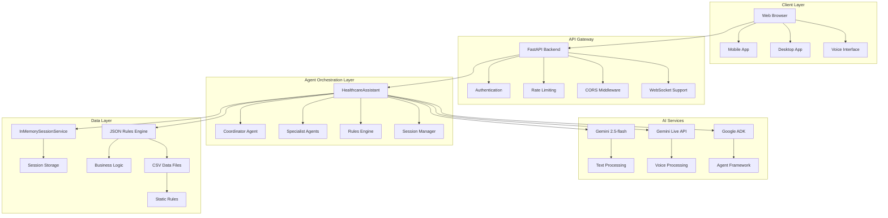
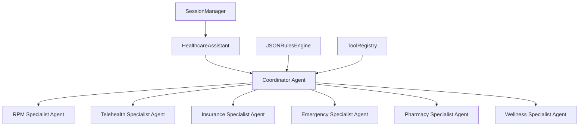
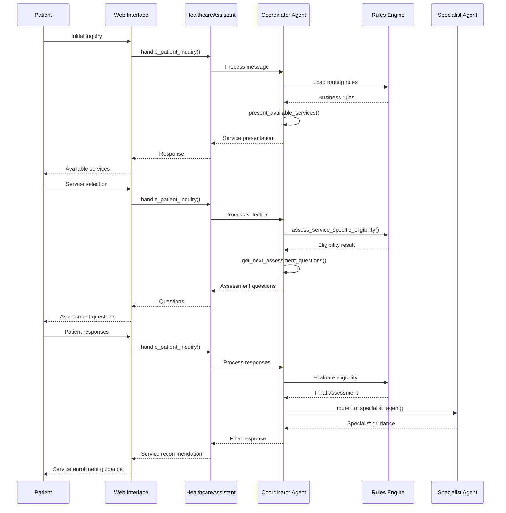
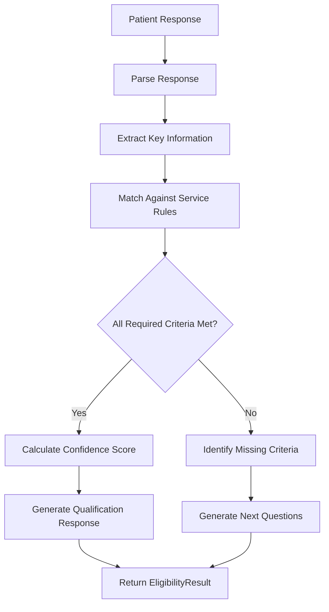
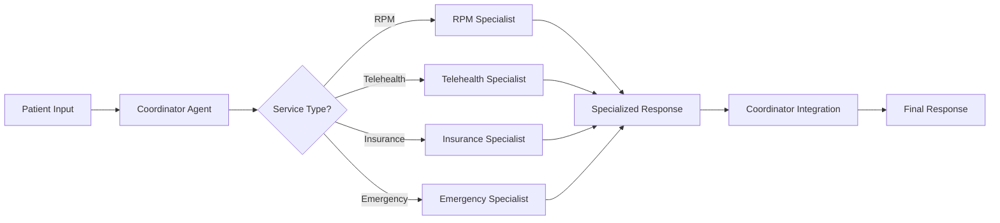

# HealthSmart Assistant - Technical Documentation
**Comprehensive System Architecture, Functions, Workflows, and Implementation Guide**

**Version:** 2.0  
**Date:** September 22, 2025  
**Status:** Production Ready  
**Architecture:** Multi-Agent Conversational AI System

---

## 📋 Table of Contents

1. [Executive Summary](#executive-summary)
2. [System Architecture](#system-architecture)
3. [Agent Architecture](#agent-architecture)
4. [Technical Stack](#technical-stack)
5. [Core Functions & APIs](#core-functions--apis)
6. [Data Flow & Workflows](#data-flow--workflows)
7. [Database Schema](#database-schema)
8. [API Endpoints](#api-endpoints)
9. [Configuration Management](#configuration-management)
10. [Deployment Architecture](#deployment-architecture)
11. [Security & Compliance](#security--compliance)
12. [Performance & Monitoring](#performance--monitoring)
13. [Development Guide](#development-guide)

---

## 🎯 Executive Summary

HealthSmart Assistant is a sophisticated multi-agent conversational AI system built on Google's Agent Development Kit (ADK) that provides intelligent healthcare service navigation and patient routing. The system uses a hybrid approach combining LLM intelligence with structured business rules to deliver accurate eligibility assessments and personalized healthcare recommendations.

### Key Capabilities
- **Multi-Agent Architecture**: 7 specialized agents with distinct roles
- **Dynamic Rule Engine**: JSON-based business logic with real-time evaluation
- **Conversational AI**: Natural language processing with context retention
- **Service Routing**: Intelligent patient-to-service matching
- **Web Interface**: Modern FastAPI-based chat interface
- **Real-time Processing**: Async/await architecture for high performance

---

## 🏗️ System Architecture

### High-Level Architecture Diagram



### Core Components

#### 1. **HealthcareAssistant (Main Orchestrator)**
- **Purpose**: Central coordination hub for all agent interactions
- **Responsibilities**: Session management, agent routing, conversation flow control
- **Key Methods**: `handle_patient_inquiry()`, `create_session()`, `get_session()`

#### 2. **Multi-Agent System**
- **Coordinator Agent**: Primary conversation handler and service router
- **Specialist Agents**: Service-specific expertise (RPM, Telehealth, Insurance)
- **Rules Engine**: Dynamic business logic evaluation
- **Session Manager**: Conversation state persistence

#### 3. **Rules Engine (JSONRulesEngine)**
- **Purpose**: Dynamic evaluation of business rules and eligibility criteria
- **Data Sources**: JSON rule files, CSV data, real-time patient responses
- **Key Methods**: `evaluate_patient_against_rules()`, `get_next_assessment_questions()`

---

## 🤖 Agent Architecture

### Agent Hierarchy



### Agent Specifications

#### **Coordinator Agent (HealthcareCoordinator)**
```python
class HealthcareCoordinator:
    name: "HealthcareCoordinator"
    model: "gemini-2.5-flash"
    tools: [
        "present_available_services",
        "load_routing_rules", 
        "assess_patient_eligibility",
        "get_next_assessment_questions",
        "assess_service_specific_eligibility",
        "route_to_specialist_agent",
        "check_emergency_symptoms",
        "get_service_specific_info",
        "get_pharmacy_savings_info",
        "llm_analyze_rpm_eligibility",
        "llm_analyze_insurance_eligibility"
    ]
    instruction: "Multi-step healthcare navigation and assessment"
```

#### **Specialist Agents**
Each specialist agent is optimized for specific healthcare services:

1. **RPM Specialist**: Remote Patient Monitoring expertise
2. **Telehealth Specialist**: Virtual care and consultation
3. **Insurance Specialist**: Coverage and enrollment assistance
4. **Emergency Specialist**: Urgent care and emergency screening
5. **Pharmacy Specialist**: Medication and prescription services
6. **Wellness Specialist**: Preventive care and wellness programs

### Agent Communication Protocol

```python
# Agent handoff mechanism
def route_to_specialist_agent(service_type: str, patient_context: str) -> str:
    """
    Routes patient to appropriate specialist agent
    Args:
        service_type: Target service (RPM, Telehealth, Insurance)
        patient_context: Current patient information and responses
    Returns:
        Specialist agent response with service-specific guidance
    """
```

---

## 🛠️ Technical Stack

### Core Technologies

| Component | Technology | Version | Purpose |
|-----------|------------|---------|---------|
| **Runtime** | Python | 3.11+ | Primary programming language |
| **Agent Framework** | Google ADK | 1.14.0 | Multi-agent orchestration |
| **AI Model** | Gemini 2.5-flash | Latest | Conversational AI |
| **Web Framework** | FastAPI | 0.104+ | REST API and web interface |
| **Data Processing** | Pandas | 2.3.2 | CSV and JSON data handling |
| **Async Runtime** | Asyncio | Built-in | Asynchronous programming |
| **Configuration** | python-dotenv | 1.0+ | Environment management |

### Dependencies

```python
# Core Dependencies
google-adk>=1.14.0
google-cloud-aiplatform>=1.38.0
google-genai>=0.3.0
google-generativeai>=0.3.0
pandas>=2.3.2
python-dotenv>=1.0.0

# Web Framework
fastapi>=0.104.0
uvicorn>=0.24.0
pydantic>=2.0.0

# Data Processing
numpy>=1.24.0
json5>=0.9.0

# Development
pytest>=7.0.0
black>=23.0.0
flake8>=6.0.0
```

### Environment Configuration

```python
# config.py
GOOGLE_CLOUD_PROJECT = "your-project-id"
GOOGLE_CLOUD_LOCATION = "us-central1"
GEMINI_API_KEY = "your-api-key"
DEFAULT_MODEL = "gemini-2.5-flash"
APP_NAME = "healthcare_assistant"
```

---

## 🔧 Core Functions & APIs

### 1. HealthcareAssistant Class

#### **Primary Methods**

```python
class HealthcareAssistant:
    def __init__(self):
        """Initialize the healthcare assistant with all agents and tools"""
        
    async def handle_patient_inquiry(
        self, 
        user_id: str, 
        message: str
    ) -> AsyncGenerator[types.GenerateContentResponse, None]:
        """
        Main entry point for patient interactions
        Args:
            user_id: Unique patient identifier
            message: Patient's message or inquiry
        Returns:
            Async generator of AI responses
        """
        
    def create_session(self, user_id: str) -> str:
        """Create new conversation session"""
        
    def get_session(self, user_id: str) -> Optional[Session]:
        """Retrieve existing conversation session"""
```

#### **Tool Functions**

```python
# Service Presentation
def present_available_services() -> str:
    """Present all available healthcare services to patients"""

# Rules Management
def load_routing_rules() -> str:
    """Load and return current business rules"""

# Eligibility Assessment
def assess_patient_eligibility(patient_responses: str) -> str:
    """Assess patient eligibility for all services"""

def assess_service_specific_eligibility(
    service_type: str, 
    patient_responses: str
) -> str:
    """Assess eligibility for specific service"""

# Question Generation
def get_next_assessment_questions(
    service_type: str, 
    patient_responses: str
) -> str:
    """Generate next assessment questions based on context"""

# Emergency Screening
def check_emergency_symptoms(patient_responses: str) -> str:
    """Check for emergency symptoms requiring immediate attention"""

# Service Information
def get_service_specific_info(service_type: str) -> str:
    """Get detailed information about specific service"""

# Specialist Routing
def route_to_specialist_agent(
    service_type: str, 
    patient_context: str
) -> str:
    """Route patient to appropriate specialist agent"""

# LLM Analysis Tools
def llm_analyze_rpm_eligibility(conversation_text: str) -> str:
    """LLM-powered RPM eligibility analysis"""

def llm_analyze_insurance_eligibility(conversation_text: str) -> str:
    """LLM-powered insurance eligibility analysis"""
```

### 2. JSONRulesEngine Class

#### **Core Methods**

```python
class JSONRulesEngine:
    def __init__(self, rules_dir: str = "rules"):
        """Initialize rules engine with JSON rule files"""
        
    def evaluate_patient_against_rules(
        self, 
        patient_responses: Dict, 
        service: str
    ) -> EligibilityResult:
        """Evaluate patient against service-specific rules"""
        
    def get_next_assessment_questions(
        self, 
        service_type: str, 
        patient_responses: Dict
    ) -> List[str]:
        """Generate next assessment questions"""
        
    def assess_service_specific_eligibility(
        self, 
        service_type: str, 
        patient_responses: str
    ) -> str:
        """Assess eligibility for specific service"""
```

#### **Data Structures**

```python
@dataclass
class EligibilityResult:
    service: str
    qualified: bool
    confidence: float
    reasoning: str
    next_questions: List[str]
    fallback_options: List[str]
    missing_criteria: List[str] = None
    decision_trail: List[Dict[str, Any]] = None

@dataclass
class PatientContext:
    user_id: str
    responses: Dict[str, Any]
    qualified_services: List[ServiceType]
    current_conversation_stage: str
    routing_confidence: float
```

---

## 🔄 Data Flow & Workflows

### 1. Patient Interaction Workflow



### 2. Rules Engine Evaluation Flow



### 3. Multi-Agent Coordination Flow



---

## 🗄️ Database Schema

### Current Implementation (InMemorySessionService)

```python
# Session Storage Structure
class Session:
    session_id: str
    user_id: str
    conversation_history: List[Dict]
    patient_context: PatientContext
    current_service: Optional[ServiceType]
    assessment_progress: Dict[str, Any]
    created_at: datetime
    updated_at: datetime
```

### Future Database Schema (PostgreSQL)

```sql
-- Patient Profiles Table
CREATE TABLE patient_profiles (
    id UUID PRIMARY KEY DEFAULT gen_random_uuid(),
    user_id VARCHAR(255) UNIQUE NOT NULL,
    first_name VARCHAR(100),
    last_name VARCHAR(100),
    date_of_birth DATE,
    email VARCHAR(255),
    phone VARCHAR(20),
    address JSONB,
    insurance_info JSONB,
    medical_history JSONB,
    created_at TIMESTAMP DEFAULT CURRENT_TIMESTAMP,
    updated_at TIMESTAMP DEFAULT CURRENT_TIMESTAMP
);

-- Conversation Sessions Table
CREATE TABLE conversation_sessions (
    id UUID PRIMARY KEY DEFAULT gen_random_uuid(),
    patient_id UUID REFERENCES patient_profiles(id),
    session_id VARCHAR(255) UNIQUE NOT NULL,
    status VARCHAR(50) DEFAULT 'active',
    current_service VARCHAR(100),
    assessment_data JSONB,
    created_at TIMESTAMP DEFAULT CURRENT_TIMESTAMP,
    updated_at TIMESTAMP DEFAULT CURRENT_TIMESTAMP
);

-- Conversation Messages Table
CREATE TABLE conversation_messages (
    id UUID PRIMARY KEY DEFAULT gen_random_uuid(),
    session_id UUID REFERENCES conversation_sessions(id),
    message_type VARCHAR(20) NOT NULL, -- 'user' or 'assistant'
    content TEXT NOT NULL,
    metadata JSONB,
    timestamp TIMESTAMP DEFAULT CURRENT_TIMESTAMP
);

-- Service Eligibility Table
CREATE TABLE service_eligibility (
    id UUID PRIMARY KEY DEFAULT gen_random_uuid(),
    session_id UUID REFERENCES conversation_sessions(id),
    service_type VARCHAR(100) NOT NULL,
    qualified BOOLEAN NOT NULL,
    confidence_score DECIMAL(3,2),
    reasoning TEXT,
    missing_criteria JSONB,
    created_at TIMESTAMP DEFAULT CURRENT_TIMESTAMP
);

-- Agent Interactions Table
CREATE TABLE agent_interactions (
    id UUID PRIMARY KEY DEFAULT gen_random_uuid(),
    session_id UUID REFERENCES conversation_sessions(id),
    agent_type VARCHAR(100) NOT NULL,
    action VARCHAR(100) NOT NULL,
    input_data JSONB,
    output_data JSONB,
    execution_time_ms INTEGER,
    created_at TIMESTAMP DEFAULT CURRENT_TIMESTAMP
);
```

---

## 🌐 API Endpoints

### FastAPI Web Interface

```python
# Main Application
app = FastAPI(
    title="HealthAngel",
    description="Healthcare Assistant with Multi-Agent Architecture",
    version="1.0.0"
)

# CORS Configuration
app.add_middleware(
    CORSMiddleware,
    allow_origins=["*"],
    allow_credentials=True,
    allow_methods=["*"],
    allow_headers=["*"],
)
```

#### **REST API Endpoints**

```python
# Chat Interface
@app.post("/api/chat", response_model=ChatResponse)
async def chat_endpoint(message: ChatMessage):
    """
    Main chat endpoint for patient interactions
    Args:
        message: ChatMessage with user_id, message, and optional session_id
    Returns:
        ChatResponse with assistant response and session info
    """

# Health Check
@app.get("/api/health")
async def health_check():
    """System health check endpoint"""
    return {"status": "healthy", "timestamp": datetime.now().isoformat()}

# Service Information
@app.get("/api/services")
async def get_services():
    """Get available healthcare services"""
    return {"services": list(SERVICE_TYPES.values())}

# Session Management
@app.get("/api/sessions/{user_id}")
async def get_session(user_id: str):
    """Get user's conversation session"""
    
@app.delete("/api/sessions/{user_id}")
async def clear_session(user_id: str):
    """Clear user's conversation session"""
```

#### **WebSocket Endpoints** (Future)

```python
@app.websocket("/ws/chat/{user_id}")
async def websocket_chat(websocket: WebSocket, user_id: str):
    """Real-time chat via WebSocket"""
```

---

## ⚙️ Configuration Management

### Environment Variables

```bash
# Required Environment Variables
GEMINI_API_KEY=your_gemini_api_key_here
GOOGLE_CLOUD_PROJECT=your_project_id
GOOGLE_CLOUD_LOCATION=us-central1

# Optional Configuration
GOOGLE_GENAI_USE_VERTEXAI=False
DEFAULT_MODEL=gemini-2.5-flash
LOG_LEVEL=INFO
RATE_LIMIT_PER_MINUTE=15
```

### Configuration Classes

```python
# config.py
class Config:
    # Google Cloud Configuration
    GOOGLE_CLOUD_PROJECT: str
    GOOGLE_CLOUD_LOCATION: str = "us-central1"
    GOOGLE_GENAI_USE_VERTEXAI: bool = True
    
    # Gemini API Configuration
    GEMINI_API_KEY: Optional[str] = None
    DEFAULT_MODEL: str = "gemini-2.5-flash"
    
    # Application Configuration
    APP_NAME: str = "healthcare_assistant"
    LOG_LEVEL: str = "INFO"
    
    # Rate Limiting
    RATE_LIMIT_PER_MINUTE: int = 15
    
    # Data Paths
    CSV_PATHS: Dict[str, str] = {
        'initial_use_cases': 'data/Marketplace _ Prodiges Health - Inital Use Cases.csv',
        'questions': 'data/Marketplace _ Prodiges Health - Questions.csv',
        'rpm_specific': 'data/Marketplace _ Prodiges Health - RPM Specific.csv'
    }
```

---

## 🚀 Deployment Architecture

### Current Deployment (Development)

```yaml
# Docker Configuration
FROM python:3.11-slim

WORKDIR /app
COPY requirements.txt .
RUN pip install -r requirements.txt

COPY . .
EXPOSE 8000

CMD ["uvicorn", "simple_web_app:app", "--host", "0.0.0.0", "--port", "8000"]
```

### Production Deployment (Future)

```yaml
# docker-compose.yml
version: '3.8'
services:
  web:
    build: .
    ports:
      - "8000:8000"
    environment:
      - GEMINI_API_KEY=${GEMINI_API_KEY}
      - DATABASE_URL=${DATABASE_URL}
    depends_on:
      - db
      - redis
  
  db:
    image: postgres:15
    environment:
      - POSTGRES_DB=healthsmart
      - POSTGRES_USER=admin
      - POSTGRES_PASSWORD=password
    volumes:
      - postgres_data:/var/lib/postgresql/data
  
  redis:
    image: redis:7-alpine
    ports:
      - "6379:6379"
  
  nginx:
    image: nginx:alpine
    ports:
      - "80:80"
      - "443:443"
    volumes:
      - ./nginx.conf:/etc/nginx/nginx.conf
    depends_on:
      - web

volumes:
  postgres_data:
```

### Google Cloud Deployment

```yaml
# cloudbuild.yaml
steps:
  - name: 'gcr.io/cloud-builders/docker'
    args: ['build', '-t', 'gcr.io/$PROJECT_ID/healthsmart', '.']
  
  - name: 'gcr.io/cloud-builders/docker'
    args: ['push', 'gcr.io/$PROJECT_ID/healthsmart']
  
  - name: 'gcr.io/cloud-builders/gcloud'
    args: ['run', 'deploy', 'healthsmart', '--image', 'gcr.io/$PROJECT_ID/healthsmart', '--platform', 'managed', '--region', 'us-central1']
```

---

## 🔒 Security & Compliance

### HIPAA Compliance

```python
# Security measures implemented
class SecurityManager:
    def __init__(self):
        self.encryption_key = self._generate_encryption_key()
        self.audit_logger = self._setup_audit_logging()
    
    def encrypt_sensitive_data(self, data: str) -> str:
        """Encrypt sensitive patient data"""
        
    def decrypt_sensitive_data(self, encrypted_data: str) -> str:
        """Decrypt sensitive patient data"""
        
    def log_audit_event(self, event: str, user_id: str, details: Dict):
        """Log audit events for compliance"""
```

### Data Protection

- **Encryption**: All sensitive data encrypted at rest and in transit
- **Access Control**: Role-based access control for admin functions
- **Audit Logging**: Comprehensive audit trail for all actions
- **Data Minimization**: Collect only necessary information
- **Consent Management**: Explicit consent for data sharing

### Security Headers

```python
# Security middleware
@app.middleware("http")
async def security_headers(request: Request, call_next):
    response = await call_next(request)
    response.headers["X-Content-Type-Options"] = "nosniff"
    response.headers["X-Frame-Options"] = "DENY"
    response.headers["X-XSS-Protection"] = "1; mode=block"
    response.headers["Strict-Transport-Security"] = "max-age=31536000; includeSubDomains"
    return response
```

---

## 📊 Performance & Monitoring

### Performance Metrics

```python
# Performance monitoring
class PerformanceMonitor:
    def __init__(self):
        self.metrics = {
            'response_times': [],
            'error_rates': [],
            'conversation_completion_rates': [],
            'api_call_counts': []
        }
    
    def record_response_time(self, duration: float):
        """Record API response time"""
        
    def record_error(self, error_type: str, error_message: str):
        """Record error occurrence"""
        
    def get_performance_summary(self) -> Dict:
        """Get performance summary statistics"""
```

### Monitoring Endpoints

```python
@app.get("/api/metrics")
async def get_metrics():
    """Get system performance metrics"""
    return {
        "response_time_avg": monitor.get_avg_response_time(),
        "error_rate": monitor.get_error_rate(),
        "active_sessions": session_manager.get_active_count(),
        "api_calls_today": monitor.get_daily_api_calls()
    }

@app.get("/api/health/detailed")
async def detailed_health_check():
    """Detailed system health check"""
    return {
        "status": "healthy",
        "timestamp": datetime.now().isoformat(),
        "components": {
            "database": check_database_health(),
            "ai_service": check_gemini_health(),
            "rules_engine": check_rules_engine_health()
        }
    }
```

### Logging Configuration

```python
# Logging setup
import logging
from datetime import datetime

logging.basicConfig(
    level=logging.INFO,
    format='%(asctime)s - %(name)s - %(levelname)s - %(message)s',
    handlers=[
        logging.FileHandler('app.log'),
        logging.StreamHandler()
    ]
)

logger = logging.getLogger(__name__)
```

---

## 🛠️ Development Guide

### Setup Instructions

```bash
# 1. Clone repository
git clone https://github.com/your-org/healthsmart.git
cd healthsmart

# 2. Create virtual environment
python -m venv venv
source venv/bin/activate  # On Windows: venv\Scripts\activate

# 3. Install dependencies
pip install -r requirements.txt

# 4. Set environment variables
cp env.example .env
# Edit .env with your API keys

# 5. Run the application
python simple_web_app.py
```

### Development Workflow

```bash
# Run tests
pytest tests/

# Run linting
flake8 app/
black app/

# Run type checking
mypy app/

# Run the application in development mode
uvicorn simple_web_app:app --reload --host 0.0.0.0 --port 8000
```

### Testing Strategy

```python
# Test structure
tests/
├── unit/
│   ├── test_agents.py
│   ├── test_rules_engine.py
│   └── test_healthcare_assistant.py
├── integration/
│   ├── test_api_endpoints.py
│   └── test_agent_workflows.py
└── e2e/
    ├── test_conversation_flows.py
    └── test_service_routing.py
```

### Code Quality Standards

- **Type Hints**: All functions must have type annotations
- **Docstrings**: Comprehensive docstrings for all public methods
- **Error Handling**: Proper exception handling and logging
- **Testing**: Minimum 80% code coverage
- **Performance**: Response times under 2 seconds
- **Security**: All security best practices implemented

---

## 📈 Future Enhancements

### Phase 2: Database Integration
- PostgreSQL integration with persistent storage
- Redis caching for improved performance
- Advanced session management

### Phase 3: Voice Interface
- Gemini Live API integration
- Real-time voice conversations
- Speech-to-text and text-to-speech

### Phase 4: Mobile Application
- React Native mobile app
- Offline capability
- Push notifications

### Phase 5: Advanced AI Features
- Multi-language support
- Advanced conversation memory
- Predictive healthcare recommendations

---

## 📞 Support & Maintenance

### Contact Information
- **Technical Lead**: Development Team
- **Product Owner**: Product Team
- **Support**: support@healthsmart.com

### Maintenance Schedule
- **Daily**: Health checks and monitoring
- **Weekly**: Performance reviews and optimization
- **Monthly**: Security updates and compliance audits
- **Quarterly**: Feature updates and enhancements

---

**Document Version**: 2.0  
**Last Updated**: September 22, 2025  
**Next Review**: October 22, 2025

---

*This documentation provides a comprehensive technical overview of the HealthSmart Assistant system. For specific implementation details, refer to the source code and individual component documentation.*
